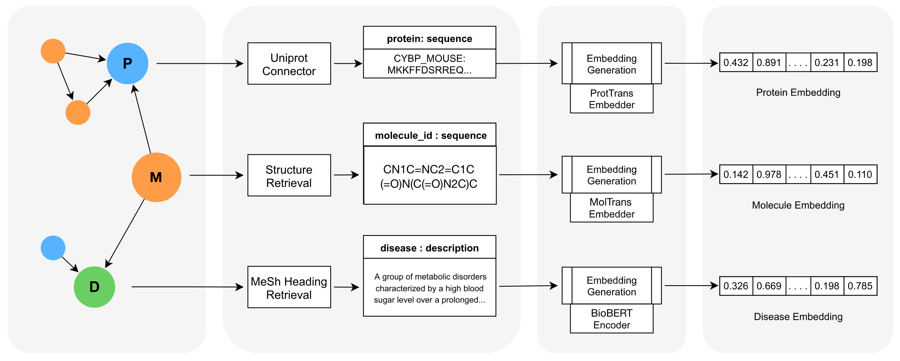

# BioBLP: A Modular Framework for Learning on Multimodal Biomedical Knowledge Graphs
<div>
<a href="https://github.com/dfdazac/blp/blob/master/LICENSE">
    </a>
    <a href="https://doi.org/10.5281/zenodo.8005711"></a>
</div>

<br><br>
<div align="center">

</div>
<br><br>

This is the official repository implementing BioBLP, presented in "BioBLP: A Modular Framework for Learning on Multimodal Biomedical Knowledge Graphs".

BioBLP is a framework that allows encoding a diverse set of multimodal data that can appear in biomedical knowledge graphs. It is based on the idea of learning embeddings for each modality separately, and then combining them into a single multimodal embedding space. The framework is modular, and allows for easy integration of new modalities.

## Usage

### 1. Install the requirements

We recommend using [Anaconda](https://www.anaconda.com/) to manage the dependencies. The following command will create and activate a new conda environment with all the required dependencies.

```bash
conda create -f environment.yml && conda activate bioblp
```

### 2. Download the data

The data can be downloaded from [here](https://doi.org/10.5281/zenodo.8005711) as a tar.gz file. This corresponds to our version of BioKG that has been decoupled from the benchmarks (see the paper for more details), and it also includes the necessary attribute data for proteins, molecules, and diseases.
The file should be placed inside the `data` folder and decompressed:

```bash
tar xzf biokgb.tar.gz
```

### 3. Training link prediction models

Use the `bioblp.train` module to train a link prediction model. For example, to train a BioBLP-D model (which encodes disease descriptions) using the RotatE scoring function, use:

```sh
python -m bioblp.train \
    --train_triples=data/biokgb/graph/biokg.links-train.csv \
    --valid_triples=data/biokgb/graph/biokg.links-valid.csv \
    --test_triples=data/biokgb/graph/biokg.links-test.csv \
    --text_data=data/biokgb/properties/biokg_meshid_to_descr_name.tsv \
    --model=rotate --dimension=256 --loss_fn=crossentropy --optimizer=adam \
    --learning_rate=2e-5 --warmup_fraction=0.05 --num_epochs=100 \
    --batch_size=1024 --eval_batch_size=64 --num_negatives=512 --in_batch_negatives=True
```

The above command on a NVIDIA A100 40G GPU takes about 9 hours to train.

More examples will be added soon. 

### 4. Benchmark tasks
* Pre-generate the input dataset with flags indicating if they are known or novel links. 
* Run `bioblp.benchmarking.preprocess.py` to prepare BM dataset for ML by shuffling, splits, etc.
* `bioblp.benchmarking.featurize.py` can be used to featurize a list of pair wise entities into vectors composed from individual vector entities.

Custom usage:
```bash
$ python -m bioblp.benchmarking.featurize -i data/benchmarks/processed/dpi_benchmark_p2n-1-10.tsv -o data/features -t kgem -f models/1baon0eg/ -j concatenate
```